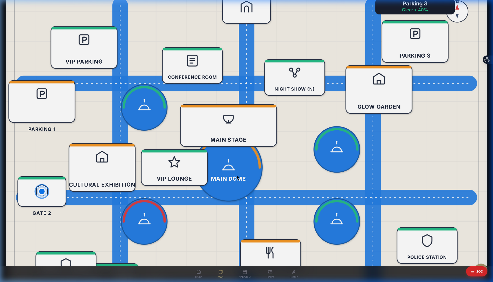
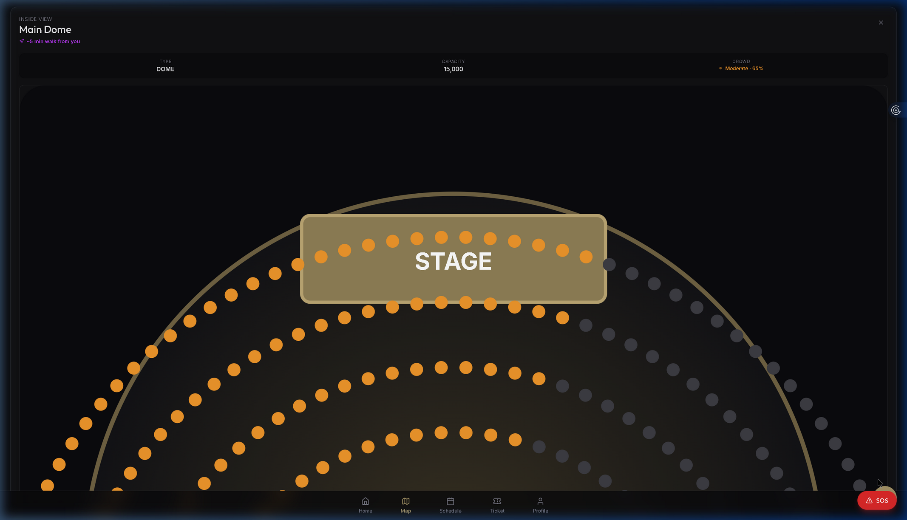

  

<h1 align="center">VenueFlow: Physical Event Experience Reimagined</h1>

<em>Submission for PromptWars: The Ultimate AI Challenge by Google</em>

## 🎯 Chosen Vertical: Physical Event Experience

**Challenge:** "Design a solution that improves the physical event experience for attendees at large-scale sporting venues. The system should address challenges such as crowd movement, waiting times, and real-time coordination, while ensuring a seamless and enjoyable experience."

### The Problem
Large-scale events (summits, concerts, sporting events) are plagued by navigational confusion, bottlenecked crowd movements at gates/food zones, and poor real-time attendee communication. Attendees often miss sessions because they can't find the location or get stuck in unexpected lines.

### Our Solution
**VenueFlow** is a comprehensive, AI-powered progressive web app designed to act as the ultimate "Event Copilot." 

1. **Intelligent Crowd Mapping:** VenueFlow visualizes the entire event floor plan. Zones (Domes, Gates, Food areas) are color-coded based on live crowd density (Green = Clear, Red = Crowded).
2. **Context-Aware Generative AI:** Integrated natively with **Google's Gemini 3.1- Flash-preview**, the built-in Event Assistant doesn't just answer generic questions—it reads the live schedule and zone data to provide hyper-accurate, contextual responses about event locations, next sessions, and where to go to avoid crowds.
3. **Emergency SOS & Navigation:** Attendees can get instant walking directions (eta + steps) to less-crowded zones or dispatch an SOS alert directly to marshals.

---

## 📸 Application Demo

### Full Video Walkthrough
*(Click to play WebP demonstration of Login, Live Map Navigation, and Gemini AI interaction)*

### Key Screens

| Live Venue Flow Map & Navigation | Context-Aware Gemini AI Assistant |
| :---: | :---: |
|  |  |

---

## 🛠️ Approach and Logic

1. **Architecture:** A fast, client-side React (Vite) application utilizing `shadcn/ui` for a premium, accessible interface.
2. **Real-time Engine:** Custom React Hooks (`useZones`, `useSessions`) synchronize database payloads across the entire app layer instantly via WebSockets, ensuring if a gate closes, the UI universally updates right away.
3. **Generative AI Injection:** The `AIChatWidget` transparently injects live venue data into the Gemini prompt payload before it hits Google's servers. **Logic:** *User asks Question -> App intercepts and injects \{Current Zones + Schedule\} -> Gemini reasons over data -> Gemini answers.*

### Assumptions Made
- Venues possess IoT sensors (like turnstiles or thermal cameras) to estimate crowd density percentages in real-time, feeding our `crowdPct` parameters.
- Attendees use mobile devices, prioritizing a "Bottom Navigation" UI over desktop layouts. 

## ☁️ Google Services Integration

1. **Google Gemini API (`@google/generative-ai`):** Powers the core contextual decision-making of the Assistant. Utilizing the fast and lightweight `gemini-1.5-flash-latest` model to ensure mobile data users aren't bottlenecked by slow AI streams.
2. **Google Cloud Run:** The application is completely containerized (using our provided `Dockerfile` and `nginx.conf`) and built specifically to be deployed scalably on Google Serverless Cloud Run.

---
**Author:** Dev Vekariya  
**Connect on LinkedIn:** [dev-vekariya-630544402](https://www.linkedin.com/in/dev-vekariya-630544402/)

*Built with ❤️ for Google PromptWars 2026*
